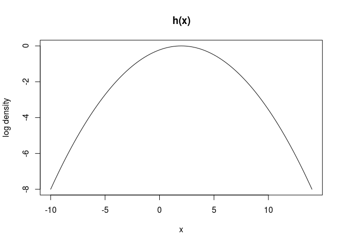
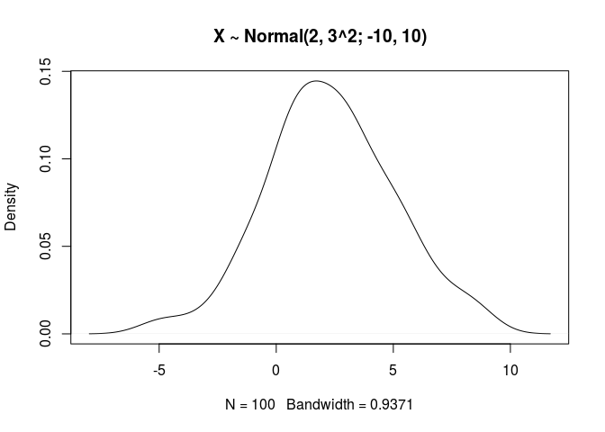
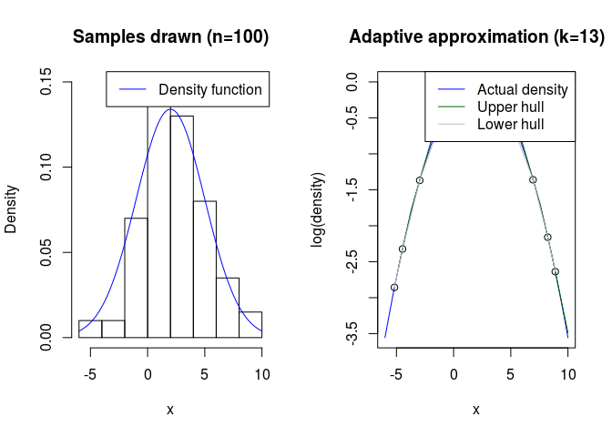

<!-- README.md is generated from README.Rmd. Please edit that file -->
adsample: Fast Adaptive Rejection Sampling
==========================================

[](https://travis-ci.org/kuperov/adsample) [](https://codecov.io/github/kuperov/adsample?branch=master)

This package implements the adaptive rejection sampling described by Gilks & Wild (1992). It is implemented in C++ and provides a convenient symbolic differentiation tool and diagnostic graphs.

The algorithm works well for densities that are expensive to compute, where sampling from an empirical distribution function (as in griddy Gibbs) would be computationally expensive.

The algorithm can sample from any univariate log concave densities. This is a large number of densities (especially if you allow minor reparameterizations) but is not all of them. See the paper!

Example
=======

In this contrived example, we draw 1,000 variates from the truncated normal distribution Normal(2, 3^2; -10, 10), which has density function
$$ f(x) \\propto I\_{|x| \\leq 10}(x)\\exp\\left\\{ -\\frac{1}{18}\\left(x - 2\\right)^2\\right\\}.$$
 The algorithm requires log density function. Assuming |*x*|≤10, we have
$$ h(x) = \\log f(x) = -\\frac{1}{18}\\left(x - 2\\right)^2$$
 and its derivative
$$ h'(x) = \\frac{d\\log f(x)}{dx} = -\\frac{x - 2}{9}.$$
 We first specify an R function that computes these values:

``` r
# log density and derivative function
h <- function(x) {
  y <- - 1/18*(x-2)^2
  yprime <- -(x - 2)/9
  c(y, yprime)
}
```

We can verify that *h*(*x*) is log concave by noticing that its second derivative *h*″(*x*)= − 1 is negative, a fact we can also check visually:

``` r
plot(Vectorize(function(x) h(x)[1]), -10, 14, ylab='log density', main='h(x)')
```



And now we call `adsample` to sample 1,000 variates. We need to provide two initial points within the support of *f* to seed the algorithm, and the bounds of its support.

``` r
library(adsample)
set.seed(123)
xs <- adsample(n = 100, log_dens = h, initialPoints = c(-1, 1), minRange = -10,
               maxRange = 10)
plot(density(xs), 'X ~ Normal(2, 3^2; -10, 10)')
```



To see what the algorithm is doing, we can run it in debug mode and use the `plot` method to display the algorithm's internal state.

``` r
set.seed(123)
dbg <- adsample(n = 100, log_dens = h, initialPoints = c(-1, 1), minRange = -10,
               maxRange = 10, debug = TRUE)
plot(dbg)
```



This plot nicely shows the upper and lower hulls (green and gray, respectively) for the log density the algorithm computes. Notice that, even though we drew 100 variates, there were far fewer evaluations of *h*(*x*) (denoted by circles).

To make it easier to construct the log density function, there is a convenience function that automatically differentiates the density symbolically:

``` r
g <- mklogdensf(exp(-1/18*(x-2)^2), x)
g(2)  # mode is at x=2, so second derivative is zero
#> [1] 0 0
```
